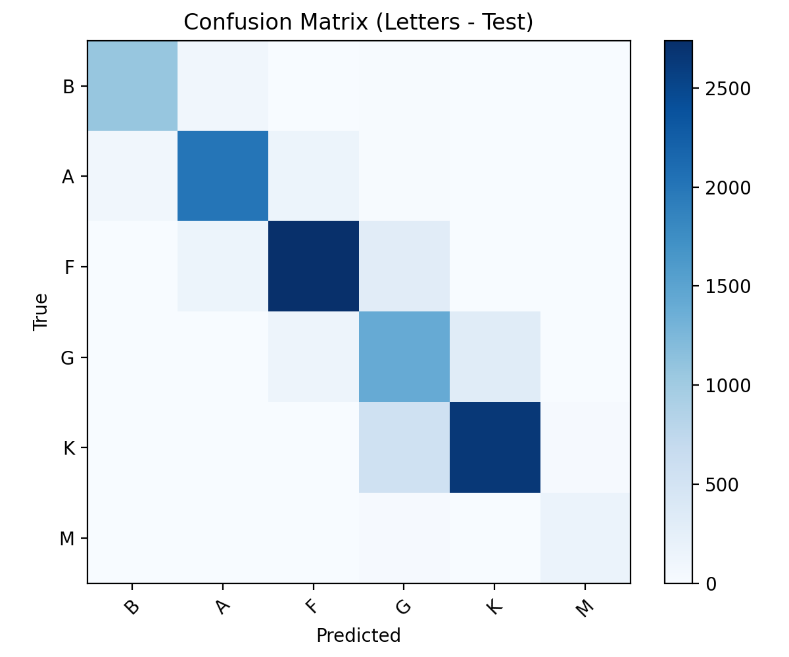

# Star Cataloguing Deep Learning Model

A catalog-driven deep-learning pipeline that classifies stars from RGB image cutouts. The model
predicts the Morgan–Keenan spectral letter (O, B, A, F, G, K, M) and the subclass digit (0–9 within
the predicted letter) from photometric imagery alone — no spectra.

Project page: **[loganmedwardsastrophy.com/star-catalog.html](https://www.loganmedwardsastrophy.com/star-catalog.html)**

## Results

Held-out test set: **14,406 samples** (96,039 total across the 70/15/15 split).

| Metric | Value |
|---|---|
| Letter top-1 (7-way) | **84.30%** |
| Letter top-2 | **98.41%** |
| Letter macro F1 | 0.8455 (precision 0.8467 / recall 0.8479) |
| Subclass top-1 (10-way digit) | 30.62% |
| Subclass top-2 | 51.50% |
| Combined exact (letter + digit) | 30.15% |

<p align="center">
  
</p>

The letter head is the headline number: it tracks the macroscopic temperature sequence robustly.
Subclass resolution is intrinsically harder, because RGB cutouts encode colour differences only
coarsely. Raw values are in [`results/test_metrics_summary.json`](results/test_metrics_summary.json).

[`results/`](results) also holds the letter-head training curves
([`training_curves_letters.png`](results/training_curves_letters.png)), the overall multi-task curves
([`training_curves_overall.png`](results/training_curves_overall.png)), and the full-resolution
combined letter × subclass confusion matrix
([`confusion_matrix_combined_test.png`](results/confusion_matrix_combined_test.png)).

Confusion concentrates at decision boundaries that are *physically* adjacent — A/F, F/G and K/M, all
neighbours in the H–R diagram — and subclass errors are locally smooth, typically off by ±1. The
combined confusion matrix is block-diagonal: errors cluster within a letter far more than they cross
letter boundaries, which is what you would expect from a model that has learned temperature as a
continuous quantity rather than a set of independent classes.

## Pipeline

| Stage | Script | Notebook | What it does |
|---|---|---|---|
| 1. Catalogue + image builder | [`src/build_star_dataset.py`](src/build_star_dataset.py) | [`01_catalogue_and_image_builder`](notebooks/01_catalogue_and_image_builder.ipynb) | Queries VizieR (Gaia DR3, HIPPARCOS, PS1, WISE, …) for coordinates, magnitudes, colours and spectral hints; fetches colour cutouts from Pan-STARRS with fallbacks; recentres, stretches and magnitude-scales each frame; rejects grayscale or low-quality frames; packs images + `metadata.csv` into a bundle. |
| 2. Multi-task CNN | [`src/train_star_cnn.py`](src/train_star_cnn.py) | [`02_star_classification_cnn`](notebooks/02_star_classification_cnn.ipynb) | Staged training of the three-head CNN, then confusion matrices, training curves, derived-label CSVs and test metrics. |
| 3. Inference | [`src/infer_stars.py`](src/infer_stars.py) | [`03_cnn_utilization`](notebooks/03_cnn_utilization.ipynb) | Loads the trained model, applies training-identical preprocessing to new cutouts, and decodes letter + subclass predictions (with ground-truth comparison when a metadata CSV is supplied). |

## Model

A compact, regularized three-block ConvNet (`Conv → BatchNorm → ReLU`) feeding global average
pooling and dense layers, with three softmax heads:

- **Letter head** — softmax over the spectral letters present in the training set.
- **Combined head** — softmax over `letter × 10 + subclass`, so the model learns letter-specific
  subclass boundaries from a single classifier.
- **Stage head** — auxiliary softmax over evolutionary stage (white dwarf / main sequence / subgiant
  / giant / supergiant / unknown).

Training is two-stage: stage 1 optimizes the letter head alone to establish a stable backbone;
stage 2 unfreezes the full multi-task model and balances letter and combined-head losses. Class
balance is handled by curved resampling plus class-balanced sample weights, the 70/15/15 split is
stratified on letter, and `tf.data` caching/prefetching keeps the input pipeline ahead of the GPU.
Plateau-triggered LR reductions and early stopping with best-weight restoration prevent overfitting.

> **On the stage head:** it did not get finished in time and reports ~0 accuracy in this run, so it
> is excluded from the headline metrics. The inference script detects a collapsed stage head
> (`STAGE_DOMINANCE_SUPPRESS`) and reports `unknown` rather than a bogus label. "Combined" throughout
> means letter + subclass digit; stage is not part of it.

## Data

The raw class distribution is steeply imbalanced — K and F dominate, O and M are rare — so the
builder applies a "curved" target distribution that softens the skew without discarding the long tail:

| Letter | Before balancing | After balancing |
|---|---|---|
| K | 30,901 | 26,154 |
| F | 30,117 | 25,754 |
| A | 17,127 | 18,356 |
| G | 12,072 | 14,881 |
| B | 5,537 | 9,322 |
| M | 285 | 1,572 |
| O | 78 | 283 |

Splits: 67,227 train / 14,406 validation / 14,406 test. These total 96,039 rather than the
post-balancing 96,322 because per-split quality gates reject a handful of frames that survived
initial balancing.

**Quality gates:** minimum peak intensity and peak-to-background ratio; maximum centroid offset from
frame centre; maximum saturated-pixel fraction; grayscale detection (RGB channels must carry
independent information).

The prepared image bundle is on Kaggle:
**[loggger/star-image-bundles](https://www.kaggle.com/datasets/loggger/star-image-bundles)**.

## Trained weights

[`models/star_rgb_cnn_staged_combined.keras`](models/star_rgb_cnn_staged_combined.keras) (6.5 MB) is
the trained multi-task model that produced the metrics above.

## Running it

```bash
pip install -r requirements.txt
```

Build a dataset from the catalogues (network-bound; start small):

```bash
python src/build_star_dataset.py --nstars 1000 --size 256 --out-images-zip star_images_bundle.zip
```

Train. The training script reads `star_images_bundle.zip` from the working directory — if you
downloaded the Kaggle bundle, **rename it to `star_images_bundle.zip`**:

```bash
python src/train_star_cnn.py
```

Run inference on an image or a folder — edit the paths at the top of the script first:

```bash
python src/infer_stars.py
```

## Limitations & future work

- **RGB-only inputs.** Spectral subclass boundaries are intrinsically fuzzy in three-band photometry,
  and are confused further by interstellar reddening.
- **Saturation & centring.** Performance is sensitive to data hygiene; quality gates exist, but
  borderline frames still leak through.
- **Rare classes.** O and M are limited by raw availability even after balancing. Targeted sampling
  or modest augmentation would help.
- **Next directions.** Calibrated photometry, extinction estimates, NIR bands, and attention pooling
  over radial profiles are the most promising routes to sharper subclass resolution.

## Repository layout

```
src/         runnable stage scripts
notebooks/   the original Colab notebooks (outputs stripped)
results/     confusion matrices, training curves, test metrics
models/      trained .keras model
docs/        full technical report (PDF)
```

### Provenance

`notebooks/` holds the original Colab notebooks verbatim, with execution outputs stripped and
nothing else changed. `src/` is the same code lifted out of those cells, byte for byte, with the
Colab-only cells left behind:

- `build_star_dataset.py` omits the notebook's opening `pip install` bootstrap cell — that is what
  `requirements.txt` is for.
- `infer_stars.py` omits the trailing `drive.mount('/content/drive')` cell, which only does anything
  inside Colab.

No other edits were needed: both scripts already used relative paths.

## Report

[`docs/Spectral_Identification_Model_Report.pdf`](docs/Spectral_Identification_Model_Report.pdf) —
full methodology, dataset construction, and error analysis.

## License

MIT — see [LICENSE](LICENSE).
